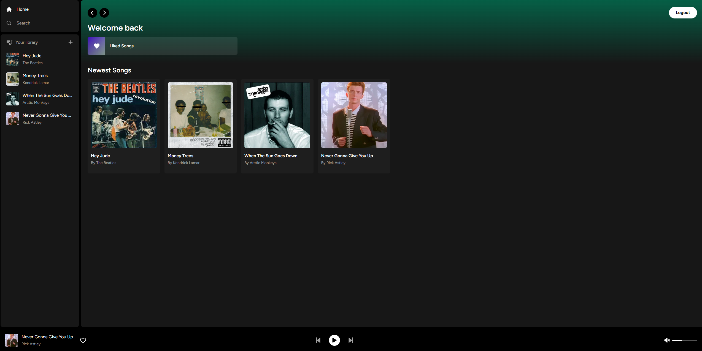

# This is a mini version of spotify

## Frameworks used:
• I used Next.js 13 and React for the project,<br>
• For the Database I used <a href="https://supabase.com/">supabase</a> which uses PostgreSQL for storing the users and the paths to the images and songs files,<br>
which I stored in a storage db.<br>
• For the design I used <a href="https://tailwindcss.com/">tailwindcss</a>.<br>
• For the deployment I used <a href="https://vercel.com/">Vercel</a><br>
### <a href="https://spotify-clone-phi-rust.vercel.app/">Live Website</a><br>

## Features:
• Create an account - required for listening to the music <br>
• Upload songs<br>
• Search songs<br>
• Like songs<br>
• Skip forward and backwards<br>
• Smart player - the player will play all the songs in a playlist for example if you chose a song from a search result it will play all the search results songs or all the liked songs etc...<hr>
• Your Library displays the songs you've uploaded<br>
• Newest Songs displays the newest songs uploaded by everyone<br>


## Installation 
clone the repo
```
git clone https://github.com/ShayCohenn/spotify_clone
```
cd into the folder
```
cd spotify_clone
```
install the dependencies
```
npm i
```
create a .env.local file using this template to connect to your own supabase db
```bash
# Update these with your Supabase details from your project settings > API
NEXT_PUBLIC_SUPABASE_URL= 
NEXT_PUBLIC_SUPABASE_ANON_KEY=
SUPABASE_SERVICE_ROLE_KEY=

```
run the application on <a href="http://localhost:3000">localhost:3000</a>
```
npm run dev
```